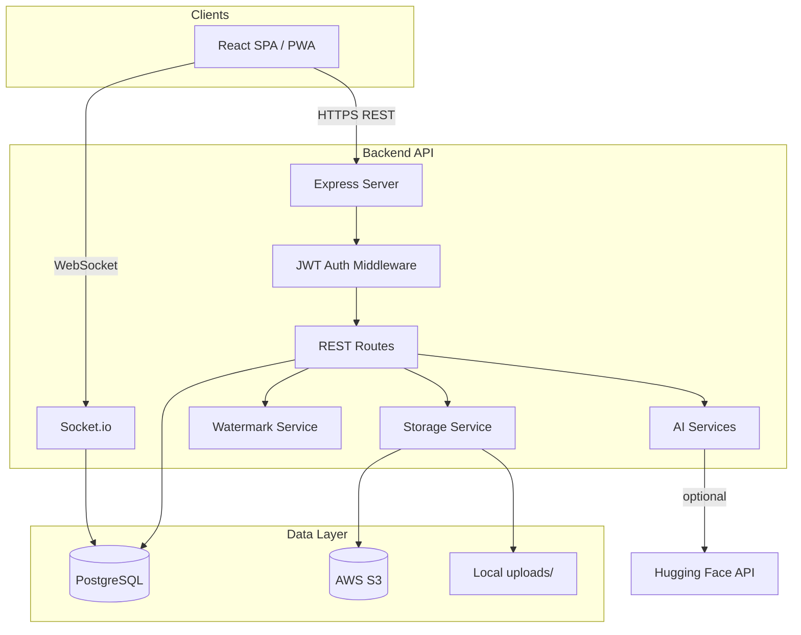

# Architecture

## System context

## Component responsibilities

| Layer | Responsibility |
|-------|----------------|
| **Frontend** | Routing, auth state, upload UX, gallery, search, notifications UI |
| **API** | Validation, authorization, orchestration |
| **Prisma** | ORM, migrations, relational integrity |
| **Storage** | Upload buffers to S3 or disk; serve static `/uploads` in dev |
| **AI tagging** | Sharp color stats + category dictionary + optional BLIP caption |
| **Face service** | Sharp 8×8 color embeddings on upload; distance match for “My Photos” (upgrade path: face-api.js + models) |
| **Notifications** | Persist + push to `user:{id}` Socket.io room |

## Security model

- **Public events/media:** readable without login (media list respects `isPublic`).
- **Private media:** only `ADMIN`, `PHOTOGRAPHER`, `CLUB_MEMBER`, or event creator.
- **Upload / social actions:** authenticated JWT.
- **Downloads:** authenticated; photos watermarked with club + event + role.

## Scalability notes

- Stateless API instances behind a load balancer
- S3 for durable media; CDN in front of bucket
- Background job queue (recommended next step) for heavy face/tag processing on large uploads
- PostgreSQL indexes on `MediaTag.label` and event filters

## Tech stack

- **Frontend:** React 19, Vite, Tailwind, TanStack Query, Socket.io client
- **Backend:** Node.js, Express, Prisma, Sharp, AWS SDK v3
- **Database:** PostgreSQL 16
