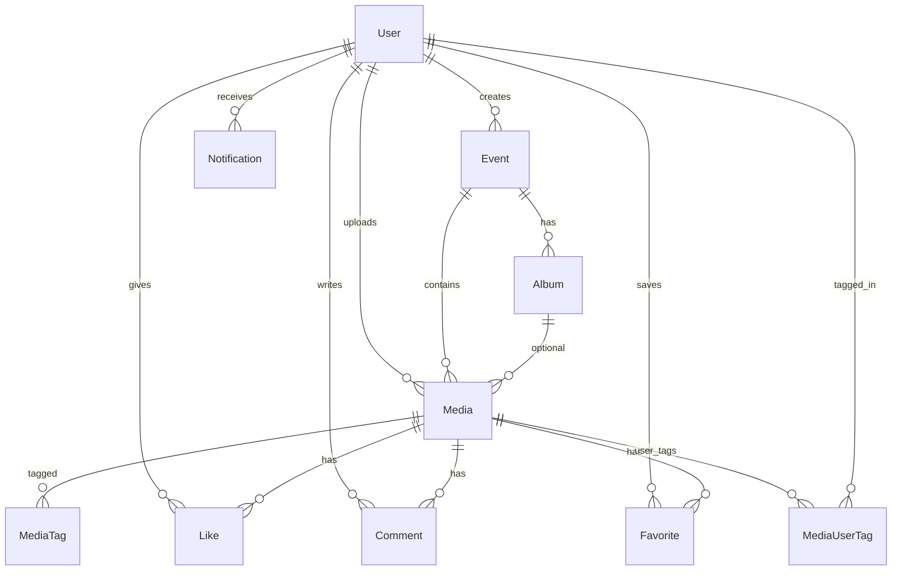

# Database schema

Entity-relationship overview (see `backend/prisma/schema.prisma` for source of truth).

## Tables

### User
| Column | Type | Notes |
|--------|------|-------|
| id | cuid | PK |
| email | string | unique |
| passwordHash | string | bcrypt |
| name | string | |
| role | enum | ADMIN, PHOTOGRAPHER, CLUB_MEMBER, VIEWER |
| faceDescriptor | json | 128-d face embedding for matching |
| avatarUrl | string? | |

### Event
| Column | Type | Notes |
|--------|------|-------|
| id | cuid | PK |
| name, description, category, clubName | string | |
| date | datetime | sortable |
| isPublic | boolean | event visibility flag |
| createdById | FK → User | |

### Album
| Column | Type | Notes |
|--------|------|-------|
| id | cuid | PK |
| name | string | |
| eventId | FK → Event | cascade delete |

### Media
| Column | Type | Notes |
|--------|------|-------|
| id | cuid | PK |
| eventId, albumId?, uploadedById | FK | |
| url, thumbnailUrl, storageKey | string | S3 or local path |
| type | PHOTO \| VIDEO | |
| isPublic | boolean | access control |
| faceData | json | array of face descriptors per image |
| width, height, sizeBytes | int | |

### MediaTag
| label | string | indexed for search |
| source | AI \| USER | |

### Social
- **Like** — unique (userId, mediaId)
- **Comment** — body text
- **Favorite** — unique (userId, mediaId)
- **MediaUserTag** — unique (mediaId, taggedUserId)

### Notification
| type | LIKE, COMMENT, TAG, SHARE |
| read | boolean |
| actorId?, mediaId? | optional FKs |

## Indexes

- `MediaTag.label` — tag search
- Unique constraints on likes, favorites, user tags
